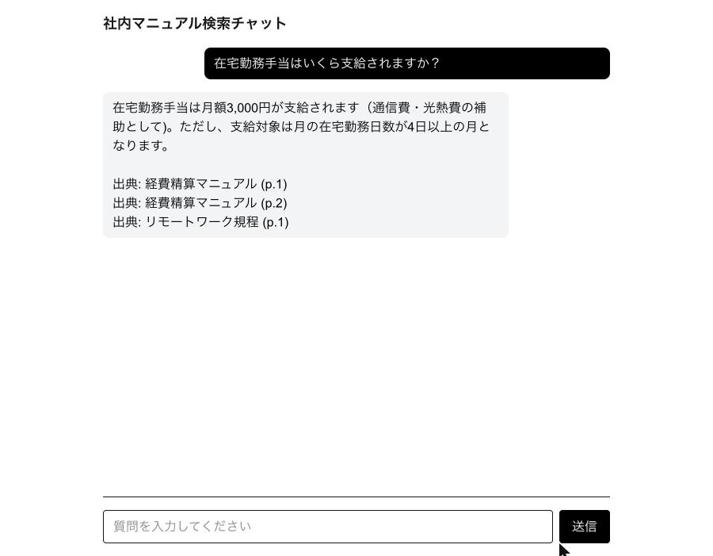

# 社内文書検索AI (RAG) — MVP

社内マニュアル(PDF)をAIに読み込ませ、チャットで質問すると出典(文書名・ページ)付きで回答するシステムです。
提案書のMVPスコープ(2週間)に基づく土台実装です。

> **注意**: このリポジトリは公開(public)です。実際の社内マニュアル(機密文書)や本番用のAPIキー・接続情報は
> 絶対にコミットしないでください。`.env.local` は `.gitignore` 済みです。

## 動作イメージ



本番環境(https://mogi-3-rag-ai.vercel.app )で実際に取得したスクリーンショットです。1つの質問に対し、複数の文書にまたがる出典が正しく表示されています。

## 技術構成

| レイヤー | 選定 |
|---|---|
| フレームワーク | Next.js (App Router) + TypeScript |
| AI | Vercel AI SDK + AI Gateway(生成: Claude Sonnet / 埋め込み: OpenAI text-embedding-3-small) |
| DB | Neon Postgres (pgvector) |
| ファイルストレージ | Vercel Blob (private) |
| 認証 | Clerk(許可ドメインのみサインイン可) |
| PDF抽出 | unpdf |

## セットアップ

```bash
npm install
vercel link            # 初回のみ
vercel env pull --yes  # .env.local に環境変数を取得
npm run db:setup       # pgvector拡張を有効化
npm run db:push        # documents / chunks テーブルを作成
npm run dev
```

## 実際のマニュアルを投入する

1. `/sign-in` で許可ドメイン(現在は `example-corp.co.jp` に設定。本番では実ドメインに変更)のメールアドレスでサインイン
2. `/admin/upload` からPDFファイルとタイトルを入力してアップロード
   - PDFテキスト抽出 → チャンク分割 → 埋め込み生成 → Neonに保存
   - 元ファイルはVercel Blob(非公開)に保存
3. `/` のチャット画面から質問すると、関連チャンクを検索して出典付きで回答

まとめて投入したい場合は `/api/upload` にスクリプトからPOSTするか、管理画面から1件ずつアップロードしてください。

## 動作確認用ダミーデータ

実際のマニュアルが届く前に、E2Eフローを確認できるダミーPDFを生成できます。

```bash
npm run gen:dummy-pdf   # scripts/dummy-manual.pdf を生成
```

生成されたPDFを `/admin/upload` からアップロードし、チャットで質問して出典付き回答が返ることを確認してください。

## セキュリティ方針

- アップロードしたPDFの原本は Vercel Blob に `access: 'private'` で保存し、公開URLは発行しない
- 全ルート(APIを含む)を Clerk 認証必須にする。加えて `ALLOWED_EMAIL_DOMAIN` 環境変数でメールドメイン制限を実施
  (Clerk公式のドメイン制限(Allowlist)は有料プラン限定のため、`src/proxy.ts` でアプリ側実装。本番では顧客企業の実ドメインに設定すること)
- AIの回答は取り込んだ文書の内容のみを根拠とし、根拠がない場合はその旨を明示する設計(ハルシネーション対策)
- APIキーやDB接続情報は Vercel の環境変数で管理し、リポジトリにはコミットしない

## Phase 2(今回のスコープ外・別見積もり)

- Word / Confluence対応
- 部署別アクセス制御(`documents.department` カラムは用意済み、未使用)
- Slack連携
- 差分更新パイプライン

## 本番運用に向けた検討事項(AIモデルの接続方法)

現在は検証用にVercel AI Gateway経由(生成: Claude Sonnet / 埋め込み: OpenAI)でモデルを呼び出しており、
無料枠には利用制限(レート制限)があります。50人規模等の本番運用に進める際は、以下のいずれかで対応してください。

1. **Vercel AI Gatewayに有料クレジットを追加**(コード変更なし、最も手軽)
2. **会社名義でAnthropic/OpenAIに直接APIキーを発行し接続**(請求の所有権・セキュリティ審査・Vercelへの依存排除が目的の場合)

2の場合の切り替え方法・コード例は知見リポジトリを参照: `dev-pattern/ai-gateway-vs-direct-provider-api-for-scale.md`

いずれもAnthropic/OpenAI(またはVercel)への支払い方法登録が必要でコストが発生するため、今回のMVP検証では未実施。

## 本番運用に向けた検討事項(DBの保存先リージョン)

提案書では「データはSupabase東京リージョン(国内)に保存」としているが、現在のMVPは`vercel integration add neon`で
自動発行された **Neon Postgres(米国 us-east-1)** を使用しており、国内保存の要件を満たせていない。

Vercel Marketplace経由でSupabaseを東京リージョン(`hnd1`)で作成しようとしたところ、**Free Planでは東京リージョンを
選択できず、Pro Plan(月額$25〜)への加入が必須**と判明した(「Upgrade your plan to support your selected
configuration.」という警告が表示される)。本番でSOC2に近い機能(監査ログ保持・優先サポート等)まで求める場合は
Team Plan(月額$599〜)が必要になる。

本番移行時は以下の対応が必要:

1. Supabase Pro Plan(以上)で東京リージョンのプロジェクトを作成
2. DBドライバの切り替え: 現在の`src/db/index.ts`・`scripts/setup-db.ts`は`@neondatabase/serverless`
   (Neon専用のHTTP接続ドライバ)を使用しており、標準的なPostgresであるSupabaseには接続できない。
   `postgres`(postgres-js)等の汎用ドライバ + `drizzle-orm/postgres-js`への置き換えが必要
3. 既存データ(documents/chunksテーブル)の移行、または本番投入前の再取り込み
4. 接続先環境変数(`DATABASE_URL`等)をSupabase側の値に切り替え

コストが発生する変更のため、今回のMVP検証では未実施。
