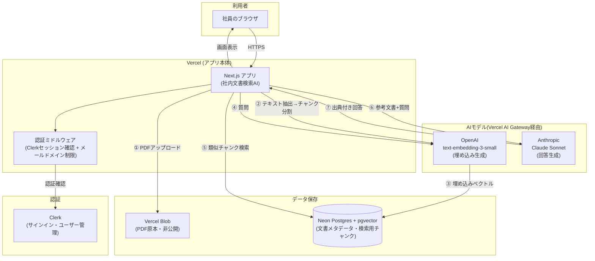
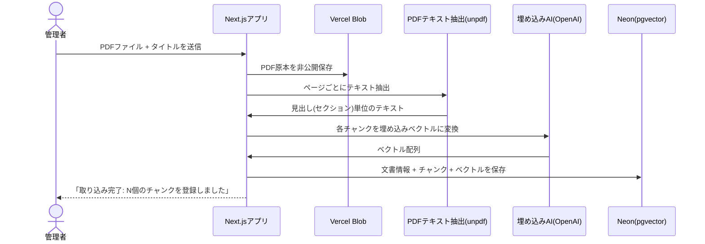
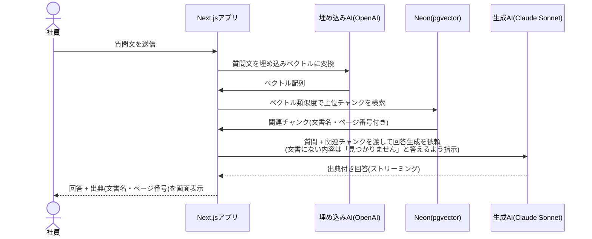

# システムアーキテクチャ図

社内文書検索AI（RAG）の全体構成と、主要な2つの処理フロー（文書登録・質問応答）をまとめます。

## 全体構成図

## 技術構成

| レイヤー | 選定技術 |
|---|---|
| フロントエンド/バックエンド | Next.js (App Router) + TypeScript、Vercelにホスティング |
| 認証 | Clerk（メールドメイン制限をアプリ側に実装） |
| ファイルストレージ | Vercel Blob（PDF原本を非公開保存） |
| データベース | Neon Postgres + pgvector拡張（文書チャンクをベクトル検索） |
| AI（回答生成） | Anthropic Claude Sonnet（Vercel AI Gateway経由） |
| AI（埋め込み） | OpenAI text-embedding-3-small（Vercel AI Gateway経由） |
| PDFテキスト抽出 | unpdf |

## フロー①: 文書登録（管理者によるPDFアップロード）

## フロー②: 質問応答（社員によるチャット利用）

## 設計上のポイント

- **ハルシネーション対策**: LLMへの指示（システムプロンプト）で「参考文書にない内容は推測しない」ことを明示し、根拠のない回答を防止
- **出典の網羅性**: 同じ内容が複数文書にまたがる場合も、該当する文書すべてを出典として列挙するよう指示
- **検索精度**: PDFのテキストを「1ページ=1チャンク」ではなく、見出し(セクション)単位で分割することで、関連度の高いチャンクが検索結果の上位に来やすい設計
- **セキュリティ**: PDF原本は非公開ストレージに保存し公開URLを発行しない。全ルートを認証必須にし、許可メールドメイン以外はアクセス不可
