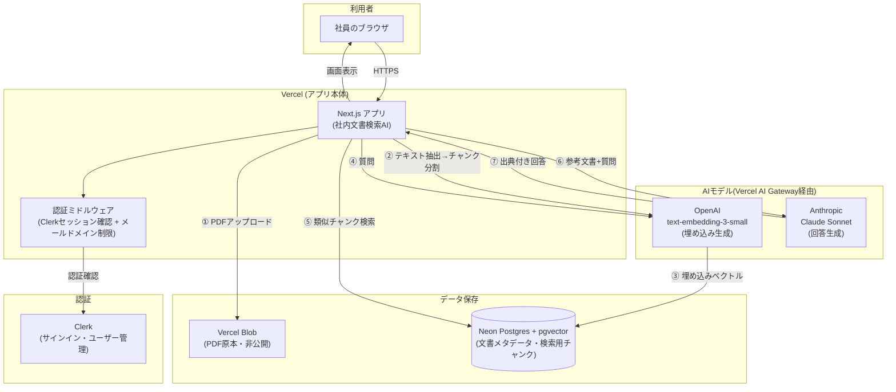
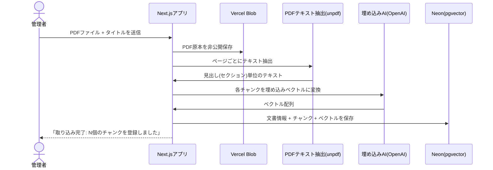
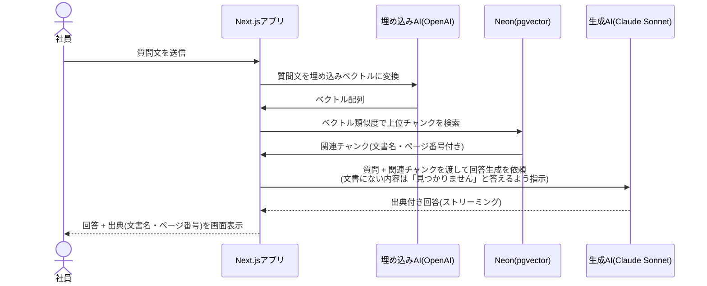

# 社内文書検索AI ご提案資料一式

このファイル1つで、**提案書 → アーキテクチャ図 → Phase 2 拡張のご提案** を続けて読めるようにまとめています。デザイン版(配色・アイコン付き)は各章のArtifactリンクを参照してください。

- [提案書(デザイン版)](https://claude.ai/code/artifact/1eabebd8-a39a-4fc2-80d3-1f9ac24b8bfd)
- [アーキテクチャ図(デザイン版・アイコン図解)](https://claude.ai/code/artifact/5b5b8211-9e16-4c0f-a895-04b8c211b375)
- [Phase 2提案書(デザイン版)](https://claude.ai/code/artifact/5f51a944-d7d0-4c9e-9255-2b5fd54d4a03)

運用に関する手順は [`operations-manual.md`](./operations-manual.md) を参照してください。

---

# 第1部 提案書

**株式会社テックブリッジ　情報システムご担当者様**

> 本提案書は模擬案件(社内RAG開発演習)向けに、実装内容・実施済みテスト結果をもとに再構成したものです。第4部の技術構成は本来の提案内容(目標構成)を示しており、MVP検証段階での実際の構成とは一部異なります(本文中の注記を参照)。

社内に散在するマニュアル(PDF)をAIチャットで即座に検索でき、出典(文書名・ページ番号)付きで回答が得られる社内文書検索AIの導入をご提案いたします。

## 1. 現状の課題

就業規則・経費精算マニュアル・情報セキュリティ規程・リモートワーク規程・社内ITツール利用ガイドなど、社内規定やマニュアルが複数のPDFファイルに分散して管理されている。社員が「有給休暇は何日付与されるか」「経費精算の締め日はいつか」といった内容を確認したい場合、該当のPDFを探し出して読む必要があり、総務・人事・情報システム部への問い合わせが日常的に発生している。特に新入社員のオンボーディング時に負荷が高く、規定の把握にばらつきが生まれやすい状態にある。

## 2. 提案する解決策

- 社内マニュアル(PDF)をアップロードするだけで、AIが自動的に検索可能な形に変換します
- 社員はチャット画面に日本語の質問を入力するだけで、該当するルールをその場で確認できます
- 回答には必ず「どの文書の何ページに書かれているか」を明示し、誤情報のリスクを抑えます
- 社内メールアドレスを持つ社員だけがアクセスできるよう、認証を設定します

## 3. 想定効果

以下は本演習で実際に検証した結果です(架空の数値ではなく、実施したテストに基づいています)。

| 指標 | 結果 |
|---|---|
| 規定確認にかかる時間 | 数分(PDFを探して読む) → 数秒(チャットで質問) |
| テスト質問での正答率 | 12問中12問(捏造回答=0件) |
| 出典表示率 | 全回答の100%に文書名+ページ番号を表示 |

## 4. 技術構成

1. 既存の社内マニュアル(PDF)をそのままアップロードします。ファイル形式の変換作業は不要です
2. AIが文章の意味を理解し、質問に対して探しやすい形に変換して保存します
3. 社員がチャットで質問すると、関連する箇所をAIが探し出し、出典付きで回答します
4. 文書に書かれていない内容を聞かれた場合は、推測で答えず「わかりません」と正直に回答します

詳しい図解は次の「第2部 アーキテクチャ図」を参照してください。

開発には、安定した運用実績のあるクラウド基盤(サーバー: Vercel／データ管理: Supabase 東京リージョン／AI: Anthropic・OpenAI)の採用を想定しています。

> ※ 本演習のMVP検証段階では、コストを抑えるためデータ管理をNeon(米国リージョン)、AI呼び出しを無料検証枠で構成して動作確認を行いました。本番移行時は上記の想定構成へ切り替えます(詳細は`operations-manual.md`を参照)。

## 5. スケジュールと費用

| フェーズ | 期間 |
|---|---|
| 要件定義・設計 | 3日 |
| 開発 | 7日 |
| テスト・調整 | 4日 |
| **合計** | **2週間** |

| 項目 | 金額 |
|---|---|
| 初期費用(MVP開発一式) | ¥480,000〜(取り込む文書量・機能追加により変動) |
| 月額費用(運用・保守) | ¥30,000〜(クラウド利用料・AI利用料・保守対応を含む。利用量により変動) |

※ 模擬案件のため参考価格として記載しています。実際の見積もりは要件確定後に別途ご提示します。

## 6. セキュリティ対策

| 項目 | 内容 | 状態 |
|---|---|---|
| データ保存先 | データはSupabase東京リージョン(国内)に保存 | MVP検証中は代替構成(Neon/米国) |
| 認証 | 社内メールドメイン制限 | 実装・動作確認済み |
| 認証情報管理 | APIキー・認証情報は環境変数管理(コードに直書きしない) | 実装・確認済み |
| 準拠方針 | SOC2の考え方(アクセス制御・暗号化・監査ログ等)を意識した設計。SOC2認定取得済みのクラウド基盤(Vercel等)を採用 | 本番移行時に本格対応 |

---

# 第2部 システムアーキテクチャ図

社内文書検索AI(RAG)の全体構成と、主要な2つの処理フロー(文書登録・質問応答)をまとめます。

## 全体構成図

## 技術構成

| レイヤー | 選定技術 |
|---|---|
| フロントエンド/バックエンド | Next.js (App Router) + TypeScript、Vercelにホスティング |
| 認証 | Clerk(メールドメイン制限をアプリ側に実装) |
| ファイルストレージ | Vercel Blob(PDF原本を非公開保存) |
| データベース | Neon Postgres + pgvector拡張(文書チャンクをベクトル検索) |
| AI(回答生成) | Anthropic Claude Sonnet(Vercel AI Gateway経由) |
| AI(埋め込み) | OpenAI text-embedding-3-small(Vercel AI Gateway経由) |
| PDFテキスト抽出 | unpdf |

## フロー①: 文書登録(管理者によるPDFアップロード)

## フロー②: 質問応答(社員によるチャット利用)

## 設計上のポイント

- **ハルシネーション対策**: LLMへの指示(システムプロンプト)で「参考文書にない内容は推測しない」ことを明示し、根拠のない回答を防止
- **出典の網羅性**: 同じ内容が複数文書にまたがる場合も、該当する文書すべてを出典として列挙するよう指示
- **検索精度**: PDFのテキストを「1ページ=1チャンク」ではなく、見出し(セクション)単位で分割することで、関連度の高いチャンクが検索結果の上位に来やすい設計
- **セキュリティ**: PDF原本は非公開ストレージに保存し公開URLを発行しない。全ルートを認証必須にし、許可メールドメイン以外はアクセス不可

---

# 第3部 Phase 2 拡張のご提案

**株式会社テックブリッジ　情報システムご担当者様**

> 本書はMVP(社内文書検索AI)の納品後、次フェーズとして提案する拡張機能の案です。模擬案件のため、内容・価格は参考として記載しています。

MVPで稼働中の社内文書検索AIを土台に、対応文書の拡大・部署別のアクセス制御・Slack連携・更新運用の自動化を行い、全社導入に耐えられる形へ拡張することをご提案いたします。

## 1. 現状(MVPで実現済みのこと)

PDF形式の社内マニュアルをアップロードし、チャットで質問すると出典付きで回答するAI検索システムが稼働中です。認証(社内メールドメイン制限)・出典表示・ハルシネーション対策(文書にない内容は正直に「わかりません」と回答)は実装・動作確認済みです。次のフェーズでは、これを「一部の文書・一部の使い方」から「全社の日常運用」に広げるための拡張を行います。

## 2. Phase 2 で追加する機能

| 機能 | 内容 | 効果 |
|---|---|---|
| Word / Confluence対応 | 現在はPDFのみ対応。Wordファイルや社内Wiki(Confluence)のページも直接取り込めるようにする | PDF変換の手間なく既存の全文書を活用できる |
| 部署別アクセス制御 | `documents.department`カラムは用意済み・未使用。部署ごとの閲覧制限を実装 | 機密性の高い文書も安全に登録・検索対象にできる |
| Slack連携 | 普段使っているSlackから直接質問できるBotを追加 | 利用のハードルが下がり定着しやすくなる |
| 差分更新パイプライン | マニュアル更新を自動検知し、変更箇所だけを再取り込み | 運用担当者の手作業(再アップロード)が不要になる |

## 3. スケジュールと費用

| フェーズ | 期間 |
|---|---|
| 要件定義・設計 | 1週間 |
| 開発 | 3週間 |
| テスト・調整 | 1週間 |
| **合計** | **5週間** |

| 項目 | 金額 |
|---|---|
| 追加開発費用(4機能一式) | ¥1,200,000〜(機能を分割しての個別発注も可能) |
| 追加の月額費用 | ¥10,000〜(Slack連携API・追加ストレージ等。利用量により変動) |

※ 模擬案件のため参考価格として記載しています。実際の見積もりは機能ごとの要件確定後に別途ご提示します。

---

AIエンジニア　丹羽紗也
